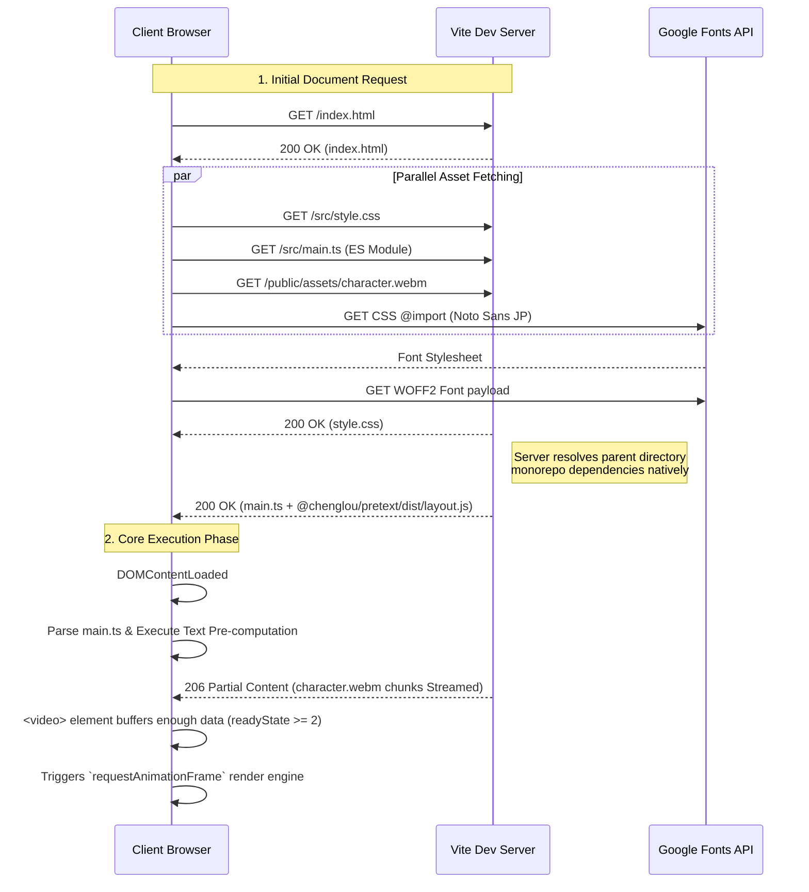

# System Architecture & Network Boot Sequence

This document maps the structural architecture of the `pretext-showcase` application and details exactly how the network behaves when a client opens the browser.

## Network Loading Sequence Map

## System Component Architecture

### Component Breakdown
1. **Vite Dev Server:** Enabled via custom `server.fs.allow` to serve monorepo parent folders securely, delivering `.ts` files on the fly.
2. **Hidden Video Element:** Acts as the data source. Streams `.webm` chunks without ever mounting visibly to the user.
3. **Pretext Library (`layout.js`):** A zero-dependency manual text-shaping engine. Completely detached from the DOM, performing purely mathematical computations `O(N)`.
4. **Main Thread Canvas:** The singular rendering surface. Re-paints thousands of `fillTexts` synchronously at 60 FPS instead of relying on heavily optimized DOM layout trees.
