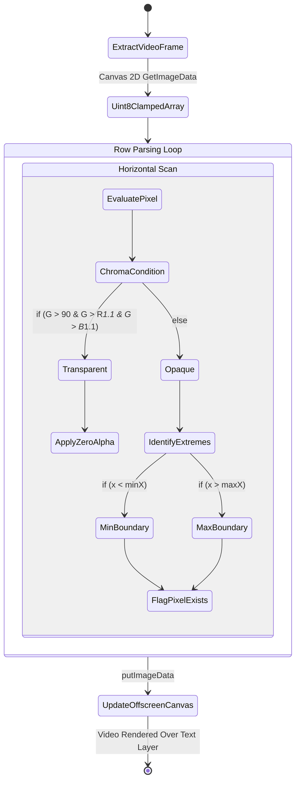

# Chroma Key Pixel Processing Pipeline

This document maps how the video stream is ripped, parsed, and converted into mathematical layout constraints via pixel-peeping.

## Row Bounding Strategy

To wrap the text perfectly against the curve of the Anime character, it is not enough to simply extract a generic rectangular "bounding box." The text engine needs incredibly granular rows mirroring the actual text lines.

The algorithm runs sequentially across the entire image buffer extracting **row-by-row silhouettes**.

### Color Science Logic
The system implements a basic RGB delta comparison to detect "Green Screen" backgrounds dynamically without requiring massive shader pipelines.
1. `G > 90` -> Validates the pixel has a healthy saturation of green (filters out dark shadows).
2. `G > R*1.1` & `G > B*1.1` -> Ensures Green is mathematically the dominant color by at least a 10% margin, avoiding aggressively stripping out flesh tones or pale eye colors.
