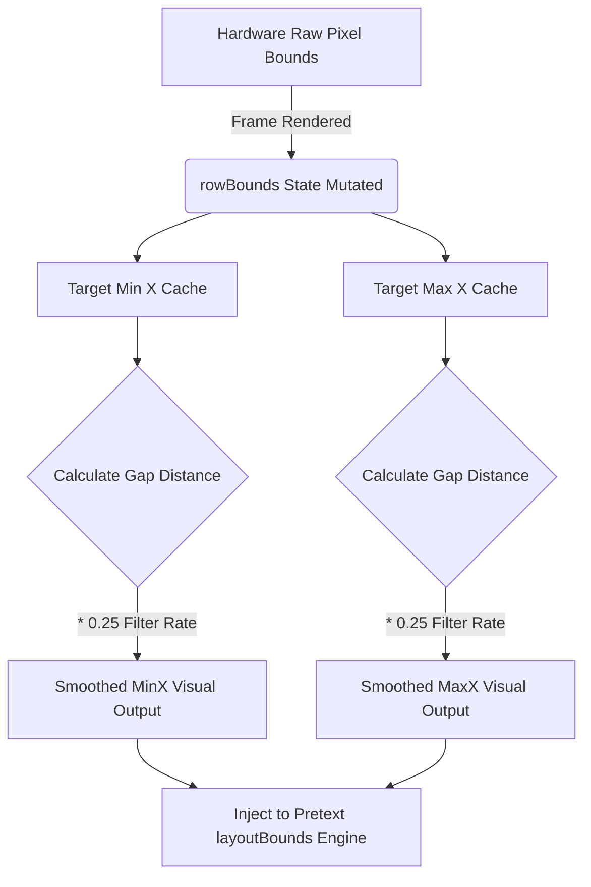
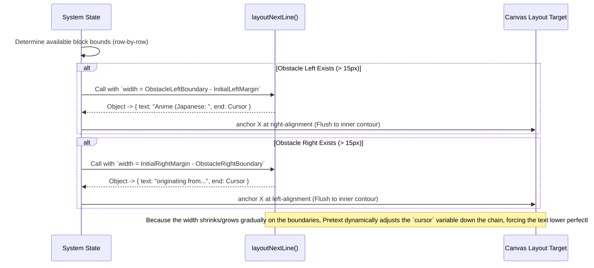

# Dynamic Text Layout Engine & Pretext Mechanics

This graph breaks down horizontally how the core layout loops interface with the `@chenglou/pretext` rendering API sequentially.

## The Temporal Smoothing Map

Because pixel loops return raw hardware data, analyzing bounding boxes frame-by-frame creates violent 1-2 pixel jitter resulting in entire text-blocks re-wrapping (the Waterfall Effect). The system resolves this via an Exponential Moving Average (EMA).

## Wrapping Logic Sequence

